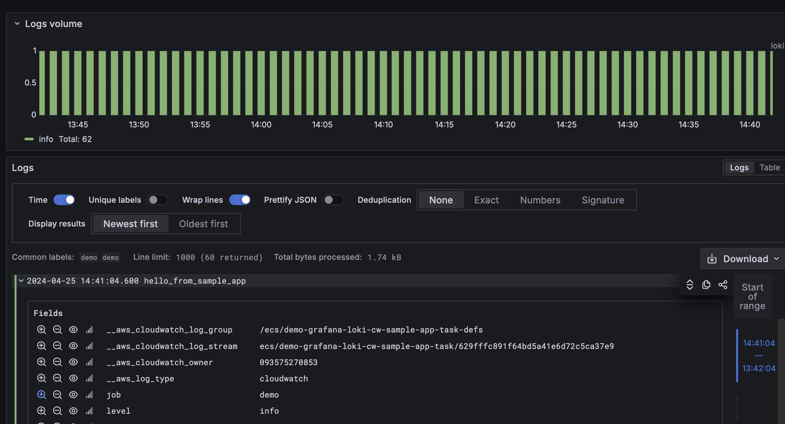

# ECS - CW - Promtail Lambda - Loki
 Promtail Lambda code: https://github.com/grafana/loki/tree/main/tools/lambda-promtail

## Upload `lambda-promtail` image to ECR


```sh
aws ecr get-login-password \
--profile USWest1 \
--region us-west-1 | docker login \
--username AWS \
--password-stdin 093575270853.dkr.ecr.us-west-1.amazonaws.com

docker pull public.ecr.aws/grafana/lambda-promtail:main
docker tag public.ecr.aws/grafana/lambda-promtail:main 093575270853.dkr.ecr.us-west-1.amazonaws.com/demo-grafana-loki-ecr:latest

docker push 093575270853.dkr.ecr.us-west-1.amazonaws.com/demo-grafana-loki-ecr:latest
```

## Grant ECR permissions to Lambda

demo-grafana-loki-ecr

https://docs.aws.amazon.com/lambda/latest/dg/images-create.html#configuration-images-permissions

```json
{
	"Sid": "LambdaECRImageRetrievalPolicy",
	"Effect": "Allow",
	"Principal": {
		"Service": "lambda.amazonaws.com"
	},
	"Action": [
	  	"ecr:BatchGetImage",
	  	"ecr:GetDownloadUrlForLayer"
	]
}   
```

## Create ECS Task 

Task definition:
  
```json
{
  "name": "demo-grafana-loki-cw-sample-app-task",
  "command": [
    "/bin/sh -c \"while true; do sleep 60; echo hello_from_sample_app; done\""
  ],
  "entryPoint": ["sh","-c"],
  "essential": true,
  "image": "alpine:3.12",
  "logConfiguration": {
    "logDriver": "awslogs"
  }
}
```

## Promtail Lambda

```sh
aws cloudformation create-stack \
--profile USWest1 \
--stack-name demo-grafana-loki-lambda-promtail-stack \
--template-body file://template.yaml \
--capabilities CAPABILITY_IAM CAPABILITY_NAMED_IAM \
--region us-west-1 \
--parameters ParameterKey=WriteAddress,ParameterValue=http://ec2-54-241-127-143.us-west-1.compute.amazonaws.com:3100/loki/api/v1/push \
ParameterKey=Username,ParameterValue=admin \
ParameterKey=Password,ParameterValue=admin \
ParameterKey=LambdaPromtailImage,ParameterValue=093575270853.dkr.ecr.us-west-1.amazonaws.com/demo-grafana-loki-ecr:latest \
ParameterKey=SkipTlsVerify,ParameterValue=true \
ParameterKey=KeepStream,ParameterValue=true \
ParameterKey=ExtraLabels,ParameterValue="\"job,demo\"" \
ParameterKey=OmitExtraLabelsPrefix,ParameterValue=true
```


## View logs in Grafana UI




