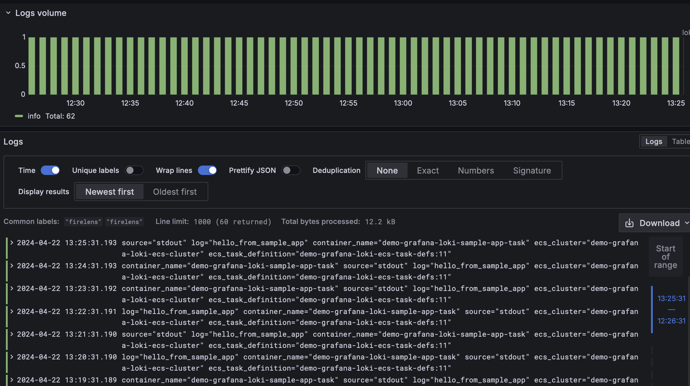

# ECS - Firelens - Loki

## Setup EC2 for Loki & Grafana

security group: Open port 3100 for Loki server; Open port 22 for ssh.

Local:

```sh
# chmod 400 "demo-grafana-loki-key.pem"

# ssh -L [local_port]:[destination_address]:[destination_port] [username]@[ssh_server]

# Without port forwarding
ssh -i demo-grafana-loki-key.pem ubuntu@ec2-54-241-127-143.us-west-1.compute.amazonaws.com

# Forwarding Grafana port 3000
ssh -L 3000:localhost:3000 -i demo-grafana-loki-key.pem ubuntu@ec2-54-241-127-143.us-west-1.compute.amazonaws.com
```

## Setup Grafana 

官网：
https://grafana.com/docs/grafana/latest/setup-grafana/installation/debian/

```sh
# Install Grafana
sudo apt-get install -y apt-transport-https software-properties-common wget
sudo mkdir -p /etc/apt/keyrings/
wget -q -O - https://apt.grafana.com/gpg.key | gpg --dearmor | sudo tee /etc/apt/keyrings/grafana.gpg > /dev/null
echo "deb [signed-by=/etc/apt/keyrings/grafana.gpg] https://apt.grafana.com stable main" | sudo tee -a /etc/apt/sources.list.d/grafana.list
sudo apt-get update
sudo apt-get install -y grafana
```

https://grafana.com/docs/grafana/latest/setup-grafana/start-restart-grafana/
```sh
# Start Grafana
sudo systemctl daemon-reload
sudo systemctl start grafana-server
# Verify success
sudo systemctl status grafana-server
# Restart
sudo systemctl restart grafana-server
```

Username: admin
Password: admin

## Setup Loki

EC2:

```sh
# Install Loki
sudo apt-get update
sudo apt-get install -y loki promtail
# Will start automatically
```

Grafana Client:

Add Loki data source
https://grafana.com/docs/grafana/latest/datasources/loki/configure-loki-data-source/

## Setup ECS

Create cluster: demo-grafana-loki-ecs-cluster

Create task definitions: demo-grafana-loki-ecs-task-defs

Sample app task definition:
手动创建

```json
{
  "name": "demo-grafana-loki-sample-app-task",
  "command": [
    "/bin/sh -c \"while true; do sleep 60; echo hello_from_sample_app; done\""
  ],
  "entryPoint": ["sh","-c"],
  "essential": true,
  "image": "alpine:3.12",
  "logConfiguration": {
    "logDriver": "awsfirelens",
    "options": {
      "Name": "loki",
      "host": "ec2-54-241-127-143.us-west-1.compute.amazonaws.com",
      "port": "3100",
      "labels": "job=\"firelens\"",
      "remove_keys": "container_id,ecs_task_arn",
      "label_keys": "$container_name,$ecs_task_definition,$ecs_cluster",
      "line_format": "key_value"
    }
  }
}
```

Firelens task definition:

```json
{
  "name": "demo-grafana-loki-log-task",
  "essential": true,
  "image": "public.ecr.aws/aws-observability/aws-for-fluent-bit:stable",
  "firelensConfiguration": {
    "type": "fluentbit",
    "options": {
      "enable-ecs-log-metadata": "true"
    }
  },
  "logConfiguration": {
    "logDriver": "awslogs",
    "options": {
      "awslogs-group": "/ecs/demo-grafana-loki-ecs-task-defs",
      "awslogs-region": "us-west-1",
      "awslogs-create-group": "true",
      "awslogs-stream-prefix": "demo-grafana-loki-log-task-container-log"
    }
  }
}
```

Run service: demo-grafana-loki-ecs-service

## View logs in Grafana UI

Explore -> Loki -> {job="\"firelens\""}

